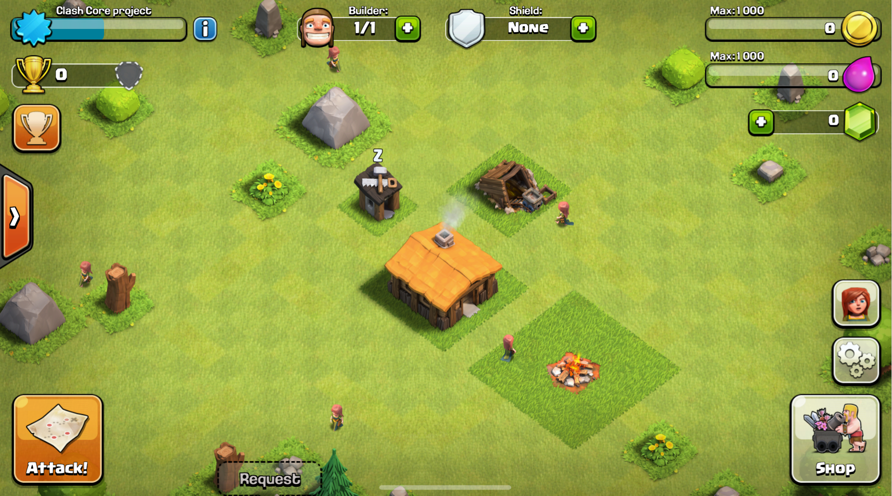

# Clash Core 6.253

Core Clash of Clans for v6.253 in Java

 

### Configuring the client app
To connect to your server, a **patched client** is required. 
Download this [base APK (MEGA)](https://mega.nz/file/UKdiGaTZ#yi-bNXX24-YEmpZgsAQcwlAZaaVo_1ef9xWeaezWehI) and change the IP in `libsb.config.so`, if you want to use ClashCore locally on your device, you can use "127.0.0.1" as the IP. If not, then you can use your device's IPv4 address. 

#### The APK was recently updated to support Android 11+ and Emulators.

### Need help?
Contact me via  
[Telegram](https://t.me/MEMozki)

### IMPORTANT
This content is not affiliated, approved, sponsored or approved specifically by Supercell and Supercell is not responsible for it. For more, see the Supercell Fan Content Policy: www.supercell.com/fan-content-policy
